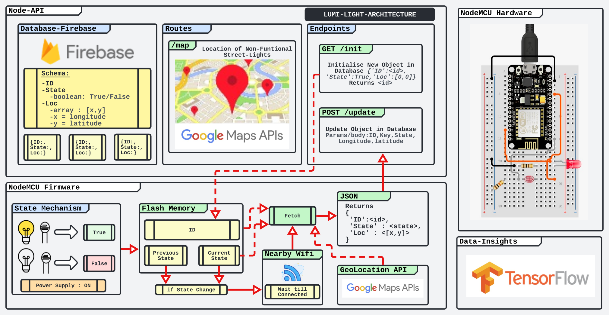

# LumiLight
*On Mission for Perennial Light Source*
- [LumiLight-API Repo](Flow/Lumi-Flow.svg)
- [LumiLight-Firmware Repo](Flow/Lumi-Flow.svg)
- [LumiLight-Deployment](Flow/Lumi-Flow.svg)
- [LumiLight-Presentation](Flow/Lumi-Flow.svg)

## The Problem Lumi-Light solves

### Problem
- Streetlights improves road safety, personal security and raise the standard of living.
- However, many times these lights remain **non- functional due to late information about the exact location** and unavailability of sufficient service support.
- Consequently, in the absence of proper lighting, some of these areas become unsafe for people at night especially elders, women, and children.
- Also affecting drivers, riders, and pedestrians on rural roads, where the road conditions are sometimes not of the desired standards.

### Our Hack
**Lumilight An Open Source & Efficient Realtime Streetlight Feedback Mechanism with Open-Database including Map Location of Defective Lights.**
- Real-time Public Database of Non-Functional Street-Lights
- Easiest Reporting Mechanism, "Just Turn on Open Hotspot"
- Zero False Reporting with Sensor Verification
- Cost-Effective Less than Rs 200 per Streetlight 
- Open Source Firmware & Software 
- Lowest Power Consumption

### Architecture

